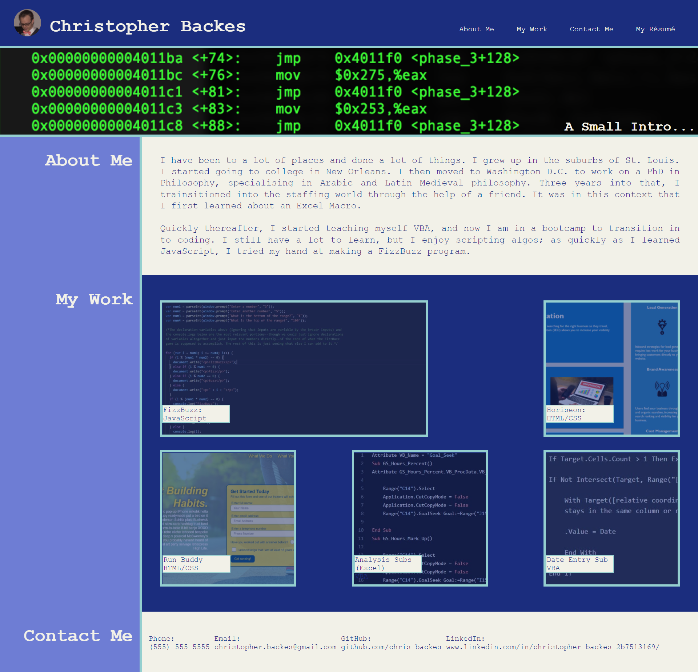

# Professional Profile

## User Story

```
AS AN employer
I WANT to view a potential employee's deployed portfolio of work samples
SO THAT I can review samples of their work and assess whether they're a good candidate for an open position
```

## Acceptance Criteria

```
GIVEN I need to sample a potential employee's previous work
WHEN I load their portfolio
THEN I am presented with the developer's name, a recent photo or avatar, and links to sections about them, their work, and how to contact them
WHEN I click one of the links in the navigation
THEN the UI scrolls to the corresponding section
WHEN I click on the link to the section about their work
THEN the UI scrolls to a section with titled images of the developer's applications
WHEN I am presented with the developer's first application
THEN that application's image should be larger in size than the others
WHEN I click on the images of the applications
THEN I am taken to that deployed application
WHEN I resize the page or view the site on various screens and devices
THEN I am presented with a responsive layout that adapts to my viewport
```

## Website

https://chris-backes.github.io/professional-profile/



## Content

The web page is broken into five sections:

- Header: contains name, image, aand navigation
- Hero Banner
- About Me
- My Work: contains three deployed web applications and two coding projects in VBA
- Contact Me (Footer): contact info and social media sites.

### Elements

The body of the page was style with the h2 elemetns having the same styling and having no margin, so as to appear to be one CSS box (instead of 3). The content of the About Me, My Work, and Contact Me alternated background colors

### Media Queries

The web page is responsive to different screensizes, so as to be compatible with larger desktop screens, smaller, tablets, and phones. In some cases, the standard sizes for these were altered to account for stylistic problems which would occur near the standard width division: in one case, increasing the width avoided an issue where 'contact me' was larger than the box containing it.

### My Work

The first element of the five is larger than the others, almost (but not quite, by double) The first three are web applications, but that last two projects are VBA projects, which operate on Excel, and hence would not be suitably deployed to a web application.
